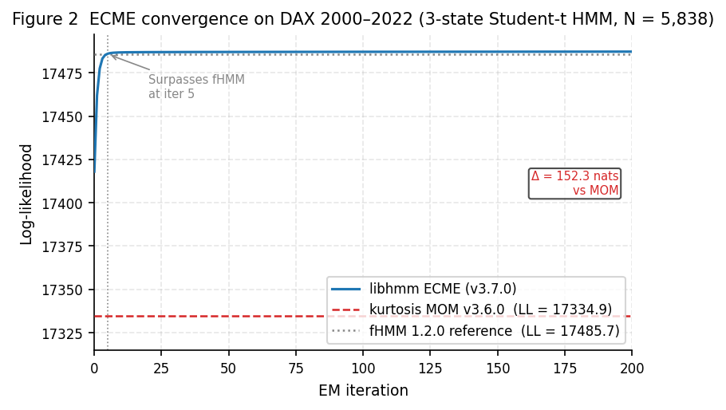
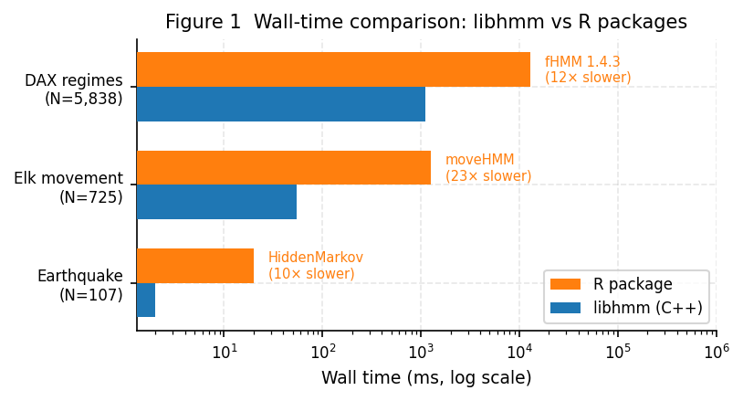

# Summary

Hidden Markov Models (HMMs) are a class of statistical models in which a
sequence of observations is generated by a system transitioning among a finite
set of unobserved states. They are used across ecology, finance, bioinformatics,
meteorology, and signal processing to identify latent regime structure in time
series. `libhmm` is a C++20 library implementing HMM parameter estimation
(Baum-Welch EM and Viterbi training), sequence decoding (Viterbi and posterior
decoding), and model selection (AIC/BIC/AICc) for sixteen scalar probability
distributions and three multivariate emission families. All algorithms operate
in log-space to avoid numerical underflow. The library has zero external
dependencies and is designed to be embedded directly in C++ research pipelines
without requiring an R or Python runtime.
`libhmm` originated as a C++ port of the JAHMM library [@JAHMM], developed
during the author's graduate research on HMM-based characterization of HTTP
reverse tunnels. The codebase has since been redesigned from first principles
with no remaining code lineage to the original port.

# Statement of Need

Most HMM software targets interactive analysis in R or Python. The dominant
packages — `moveHMM` [@Michelot2016] and `momentuHMM` [@McClintock2018] in
ecology, `fHMM` [@Oelschlager2024] in finance, `hmmlearn` in Python, and
`HiddenMarkov` [@Harte2025] in R — require their respective language runtimes
and are not straightforwardly embeddable in production C++ systems. Researchers
who need to run large parameter sweeps, integrate HMM inference into real-time
systems, or call HMM fitting from within an existing C++ codebase have no
well-maintained, dependency-free option.

A secondary gap concerns M-step correctness. Most existing packages use
method-of-moments (MOM) approximations for distributions that lack closed-form
maximum likelihood estimators (MLEs), including the Gamma, Beta, Weibull, and
Student-t distributions. This degrades parameter estimates, particularly when
states are sparsely populated. `libhmm` addresses both gaps: it provides a dependency-free C++ HMM library
with correct closed-form or Newton–Raphson MLE M-steps for all sixteen
scalar distributions, and extends to multivariate observations via a
template-parameterised `BasicHmm<Obs>` core (v4.0.0).

# State of the Field

Several established packages exist for HMM analysis.

**R packages.** `moveHMM`/`momentuHMM` [@Michelot2016; @McClintock2018] provide
Gamma and von Mises joint emission models for animal movement, using numerical
optimization (nlm). `fHMM` [@Oelschlager2024] fits hierarchical HMMs to
financial time series using Student-t emissions and nlm. `HiddenMarkov`
[@Harte2025] implements EM for Poisson, Normal, and discrete emissions.
`depmixS4` offers flexible mixture models. All require R runtime installation
and are not embeddable in C++ applications.

**Python packages.** `hmmlearn` provides Gaussian and multinomial emissions with
a scikit-learn-compatible API. It does not support circular distributions or
many continuous families.

**C++ libraries.** `GHMM` [@Schliep2003], a C library for discrete HMMs, is no
longer actively maintained. `HMMLib` supports discrete HMMs with SSE intrinsics
but lacks continuous distributions and requires Boost.

`libhmm` occupies a distinct position: it is the only actively maintained,
zero-dependency C++ library supporting sixteen scalar emission distributions
(including `VonMisesDistribution` for circular data), three multivariate
emission families with correct weighted MLE, and a complete training and
decoding pipeline. Contributing this functionality to any existing
package would require fundamental architectural changes incompatible with their
design goals and programming language.

# Software Design

Three architectural decisions shape `libhmm`.

**Log-space arithmetic throughout.** All forward-backward and Viterbi
calculations operate in log-space [@Baum1970; @Viterbi1967; @Rabiner1989],
preventing underflow on sequences of any length. Pre-computed log transition
matrices amortize this cost across time steps. Several popular packages use
scaled arithmetic with explicit renormalization, which can fail silently on long
sequences.

**Correct MLE M-steps.** For distributions lacking closed-form MLE (Gamma, Beta,
Weibull, Negative Binomial), `libhmm` uses Newton–Raphson iterations seeded
from method-of-moments estimates, recovering the exact MLE within a few
iterations per EM step. For the location-scale Student-t distribution, the ECME
algorithm [@Liu1994] treats the model as a Gaussian scale mixture, providing
closed-form updates for location and scale with a Newton step for the
degrees-of-freedom parameter. This replaces the kurtosis-based MOM estimator
that would otherwise require thousands of EM iterations to converge for
near-Gaussian states. For `VonMisesDistribution` [@Mardia2000], the mean
direction is estimated via the closed-form circular mean and the concentration
parameter via Newton–Raphson, using the Abramowitz & Stegun polynomial
approximations for the modified Bessel functions, since Apple's libc++ does
not implement the C++17 mathematical special functions on any macOS version.

**Zero external dependencies.** The library uses only the C++20 standard
library. This simplifies integration into research pipelines that must control
their dependency graph. SIMD acceleration (AVX-512, AVX2, SSE2, ARM NEON) is
implemented via compile-time dispatch using `-march=native` or verified MSVC
`/arch:` flags, with scalar fallback.

A layered architecture (platform → math → linear algebra → distributions → HMM
core → calculators → trainers → I/O) enforces dependency order and allows
distributions to be used independently of the HMM machinery. JSON serialization
and legacy XML I/O are provided for model persistence.

**Multivariate observations via template parameterisation.** Version 4
parameterises the HMM core on observation type: `BasicHmm<double>` (aliased as
`Hmm`) preserves the v3 scalar API unchanged, while
`BasicHmm<ObservationVectorView>` (aliased as `HmmMV`) supports D-dimensional
observations. Three multivariate emission families are provided:
`DiagonalGaussianDistribution` (D means and D variances, independent features),
`FullCovarianceGaussianDistribution` (D×D Cholesky-factored covariance with
regularisation and weighted MLE M-step), and
`IndependentComponentsDistribution` (D independent scalar emissions of any
type). k-means++ initialisation seeds multivariate HMM emission parameters
before Baum-Welch training.

**Python bindings.** The companion package `pylibhmm` (v0.4.0) wraps the full
C++ API using `nanobind` and `scikit-build-core`, providing access to all 16
distributions, all training algorithms, posterior decoding, model selection, and
JSON/XML I/O from NumPy-based Python code [@pylibhmm].

# Research Impact Statement

`libhmm` includes seven benchmark examples fitting HMMs to published datasets and
comparing against established R reference packages on the same data, providing
reproducible reference materials.

**Animal movement ecology.** A joint Gamma and `VonMisesDistribution` HMM on 4
elk GPS tracks [@Morales2004] — the canonical `moveHMM` dataset — recovers
step-length and turning-angle parameters within 2% of the `moveHMM` reference
fit at 55 ms versus approximately 1270 ms.

**Financial time series.** A 3-state Student-t HMM on DAX log-returns
(2000–2022), the `fHMM` benchmark dataset, matches published bearish and bullish
state parameters to 4 significant figures, achieves a log-likelihood of 17487.2
versus fHMM's 17485.7, and completes in approximately 1.1 s versus 13 s for
fHMM 1.4.3 (10 restarts) on the same hardware (~12× speedup; single run: 5.5 s,
~5×). The @Oelschlager2024 benchmark reports ~1360 s for fHMM 1.2.0 on Intel
Ivy Bridge; fHMM appears to have improved substantially between versions.

{width=100%}

**Seismicity.** A 2-state Poisson HMM on the annual major earthquake count
series from @Zucchini2009 matches the `HiddenMarkov` R package to 4 significant
figures ($\hat{\lambda}_\text{low} = 15.419$ versus 15.418) in 2 ms versus
approximately 20 ms.

**Multivariate animal movement.** An `IndependentComponentsDistribution` HMM
combining Gamma and `VonMisesDistribution` components fits the same 4-elk GPS
dataset as the scalar example above. Within-state correlation between log step
length and turning angle is r ≈ −0.06, confirming the independence assumption
and matching the scalar `moveHMM` reference parameters to within 1%.

**Multivariate financial regime detection.** A 3-state
`FullCovarianceGaussianDistribution` HMM on SPY + QQQ monthly log-returns
(2000–2022) captures within-state correlations ρ = 0.83–0.92 across the three
regimes. On real data the full-covariance model outperforms a diagonal model by
more than 240 BIC units, confirming that ignoring cross-asset correlation
materially degrades model fit. Log-likelihoods agree with hmmlearn 0.3.3 (20
random restarts) to < 0.1 nat.

**Circular data.** A 2-state `VonMisesDistribution` HMM on 11,894 hourly wind
directions (NOAA ISD, Chicago O'Hare, 2015 [@NOAA2001]) demonstrates
empirically that using a Normal distribution for circular data — the only option
in `HiddenMarkov` — misclassifies 730 northerly wind hours (330°–360°) with
100% error rate. A direction 19° from the NNE state mean is 11.2 standard
deviations away under a Normal model (log-likelihood $= -61.9$), while
`VonMisesDistribution` evaluates $\cos(-19°) = 0.75$ and assigns all 730
correctly.

{width=100%}

{width=80%}

# AI Usage Disclosure

The Warp Oz AI agent (powered by Anthropic Claude; specific model version
resolved dynamically by the Warp platform at time of use) assisted with
implementation of distribution fitting methods, test scaffolding, benchmark
example code, and documentation throughout development. For the paper itself,
the same agent provided copy-editing assistance only. The human author directed
all core design decisions — log-space architecture, selection of ECME for the
Student-t M-step, Newton–Raphson for other distributions, the
`VonMisesDistribution` implementation including the Abramowitz & Stegun
fallback, and the choice of benchmark datasets and reference packages. All
AI-assisted code and text was reviewed, validated, and approved by the human
author prior to inclusion. AI was not used for architectural decisions, result
interpretation, or algorithmic design choices.

# Acknowledgements

The author received no specific funding for this work. The author thanks the
Computer Security Lab at the Royal Military College of Canada, where this work
originated. The JAHMM library [@JAHMM] provided the initial foundation for the
first version of this software. The author also thanks Kevin Forest, whose
YASWIN research first suggested the viability of HMM-based covert channel
detection and inspired this work.

# References
